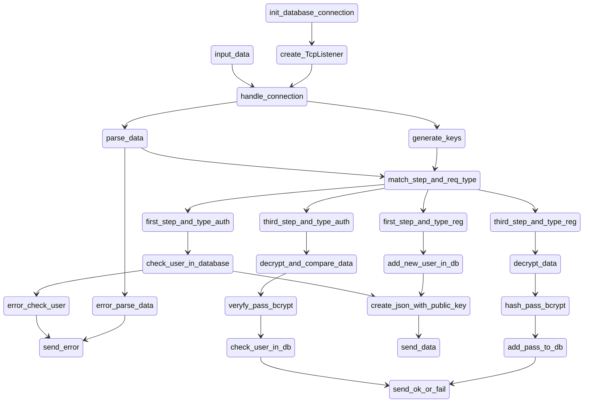

[](https://github.com/CNDspace/SidZher_crypto/actions/workflows/check.yml)

# SidZher crypto project

### RU Краткое описание
Данный проект используется для генерации ассиметричных ключей и взаимодействией с базой данных во время работы основного проекта SidZher, проект написан на Rust для увеличения скорости генерации ключей шифрования.

Автор: Александр Жердев

### EN Little description
This project is used to generate asymmetric keys and interact with the database while the main SidZher project is running, the project is written in Rust to increase the speed of generating encryption keys.

Author: Alexander Zherdev

## Build and run
### Debug build
```shell
cargo run
```
Or use compile build in `<project_path>/target/debug/sidzher_crypto_bin`
```shell
cargo build
```

Debug build in runtime slow than release, if you not debug Sidzher crypto use release build

### Release build
```shell
cargo run --release
```
Or use compile build in `<project_path>/target/release/sidzher_crypto_bin`:
```shell
cargo build --release
```

## Code flow graph


## Transfer type between server and Sidzher Crypto

### We use json, struct here:

```json
{
  "step": 1,
  "req_type": "<type>",
  "user": "<user>",
  "data": ""
}

```

`step` is used for phased synchronization between the server and SidZher crypto module

`req_type` can be `auth` or `reg`, where:

- `auth` - Used for authentificate users
- `reg` - Used for register new users

`user` field used for users login name

`data` field used for transfer public key, encrypted data and answer for login


